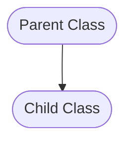
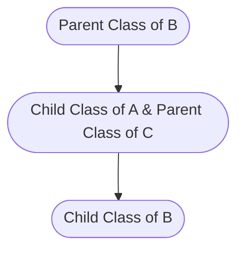

# Inheritace

## Overview
- Inheritance in real life means getting property, title, debts, entitlement from parents. Inheritance in Javascript is a concept that is used to inherit fields and methods of a class.

- The class that is being inherited is known as parent class, and the class that is inheriting the parent class is known as child class.

### Why **inheritance** is needed?
- Inheritance enables us to define a class that takes all functionalities (other than private) from a parent class and allows us to add more functionality to child class.
- Inheritance allows code reusability and avoid repetation. 

### How to create **inheritance**?
- To create **inheritance** we have to use `extends` keyword.
- Before initializing child class constructot, first we have to call parent class constructor by `super([arguments])` to get access to the methods and fields of parent class.

## Diagram:
### - Single Level Inheritance:



### - Multilevel Inheritance:


## Example:

```javascript
//parent class
class Logger {
  #writeStream;
  constructor(writeStream) {
    this.#writeStream = writeStream;
  }

  log(messsage) {
    this.#writeStream.write("message" + "\n");
  }
}

//child class
class FancyLogger extends Logger {
  constructor(writeStream) {
    super(writeStream); //calling parent class constructor
  }

  fancyLog(message) {
    this.log("Fancy>>> " + message);
  }
}
```

```javascript
const main() {
  const {stdout} = process;

  //calling parent class
  const logger = new Logger(stdout);
  logger.log("This is normal log.");

  //calling child class
  const fancyLogger = new FancyLogger(stdout);
  fancyLogger.fancyLog("This is fancy log.");
}
```
```
Output:
This is normal log.
Fancy>>> This is a fancy log.
```

### [⬆ Top](#inheritace)
### [⬅ Back](../june.md#9th-june-2023)